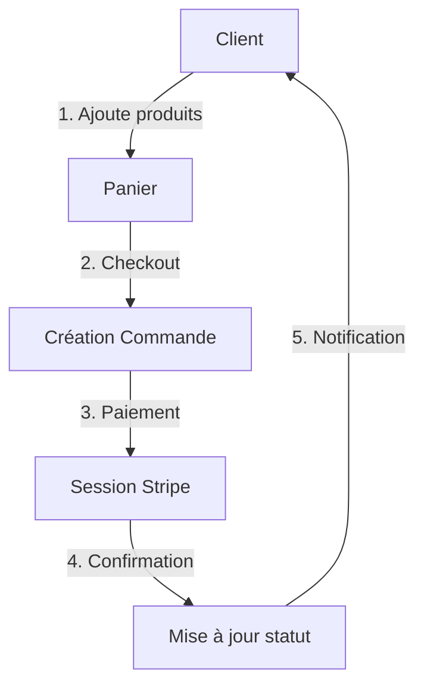

# Documentation E-Commerce .NET

## Architecture du Projet

Le projet suit une architecture en couches (Clean Architecture) avec les composants suivants :

### 1. E-Commerce.Core
- Contient les entités de base (Domain Models)
- Définit les interfaces (Contracts)
- Contient les DTOs (Data Transfer Objects)
- Point central de la logique métier

### 2. E-Commerce.Infrastructure
- Gère la persistance des données
- Implémente les repositories
- Configure la base de données
- Gère les migrations

### 3. E-Commerce.Services
- Implémente la logique métier
- Gère les services externes (ex: Stripe)
- Effectue les mappings entre les entités

### 4. E-Commerce.Web
- Interface utilisateur
- Controllers
- Vues Razor
- Points d'entrée de l'application

## Flux de Données Principal



## Points Clés Pédagogiques

### 1. Gestion du Panier (CartService)
- Utilisation du pattern Repository
- Gestion des sessions utilisateur
- Calcul dynamique des totaux

### 2. Processus de Commande (OrderService)
- Mapping automatique avec AutoMapper
- Gestion des statuts de commande
- Validation des données

### 3. Intégration Stripe (StripeSessionService)
```csharp
// Points importants :
// 1. Configuration sécurisée de l'API key
StripeConfiguration.ApiKey = _configuration["Stripe:SecretKey"];

// 2. Création de session de paiement
var sessionOptions = new SessionCreateOptions {
    PaymentMethodTypes = new List<string> { "card" },
    LineItems = ...,
    Mode = "payment"
};

// 3. Gestion des webhooks pour les notifications
```

### 4. Bonnes Pratiques Implémentées
- Injection de dépendances
- Pattern Repository
- DTOs pour la séparation des couches
- Gestion sécurisée des paiements
- Validation des données

## Points d'Attention pour les Étudiants

1. **Sécurité**
   - Ne jamais exposer les clés API
   - Valider toutes les entrées utilisateur
   - Utiliser HTTPS en production

2. **Performance**
   - Utilisation appropriée d'async/await
   - Optimisation des requêtes DB
   - Mise en cache quand nécessaire

3. **Maintenance**
   - Suivre les conventions de nommage
   - Documenter le code important
   - Utiliser les principes SOLID

## Exercices Suggérés

1. Ajouter un système de remises personnalisées
2. Implémenter un système de notifications par email
3. Créer un dashboard administrateur
4. Ajouter des tests unitaires

## Ressources Additionnelles

- [Documentation officielle .NET](https://docs.microsoft.com/en-us/dotnet/)
- [Documentation Stripe](https://stripe.com/docs)
- [Principes Clean Architecture](https://blog.cleancoder.com/uncle-bob/2012/08/13/the-clean-architecture.html)
